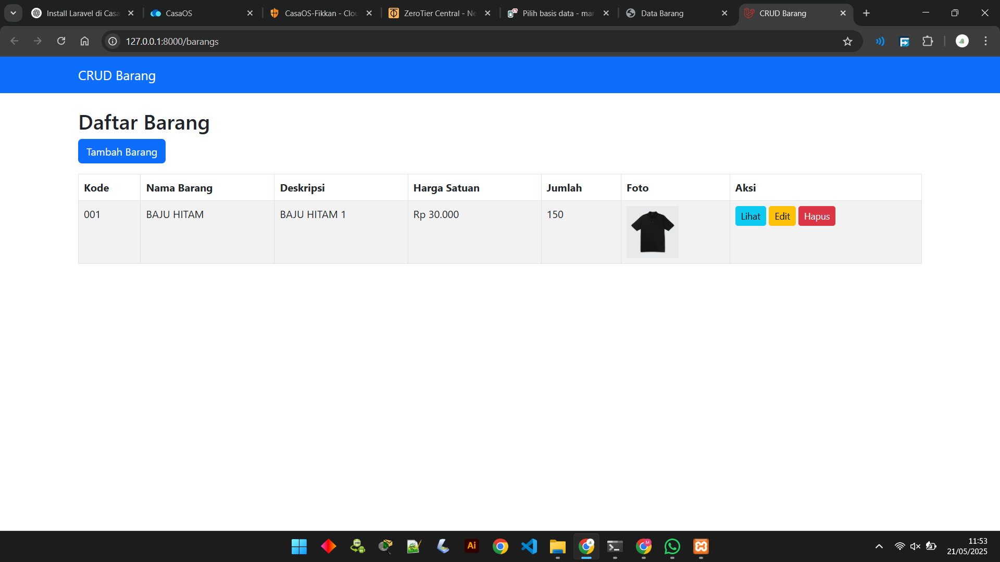
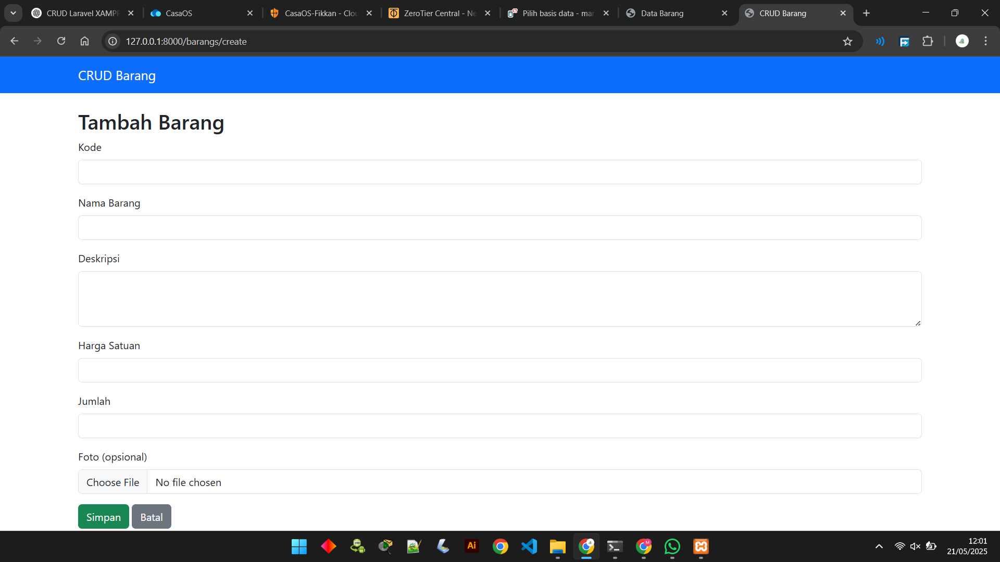
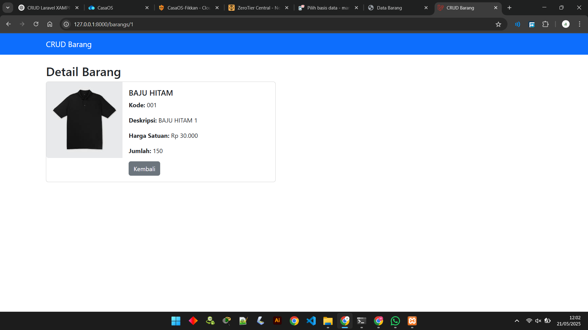

# 📦 CRUD Barang Laravel

Sebuah aplikasi web sederhana untuk manajemen data barang (CRUD - Create, Read, Update, Delete) menggunakan **Laravel 10+**, **Bootstrap**, dan **XAMPP**.


---

## ✨ Fitur

✅ Tambah Barang  
✅ Edit Barang  
✅ Hapus Barang  
✅ Lihat Detail Barang  
✅ Upload Foto Barang  
✅ Validasi Form Otomatis

## 🚀 Cara Menjalankan

### Installasi
```bash
git clone https://github.com/Fikkanel/Tugas-RPL-PHP-Laravel.git
cd Tugas-RPL-PHP-Laravel
composer install
cp .env.example .env
php artisan key:generate
php artisan migrate
php artisan serve
```
---
## 📂 Struktur Folder
```bash
├── app/
│ └── Http/
│ └── Controllers/
│ └── BarangController.php
├── resources/
│ └── views/
│ └── barangs/
│ ├── index.blade.php
│ ├── create.blade.php
│ ├── edit.blade.php
│ └── show.blade.php
├── public/
│ └── foto_barang/
```

### 🖼️ Preview Antarmuka
| Halaman   | Tampilan                                                             |
| --------- | -------------------------------------------------------------------- |
| Dashboard |    |
| Tambah    |  |
| Detail    |     |
